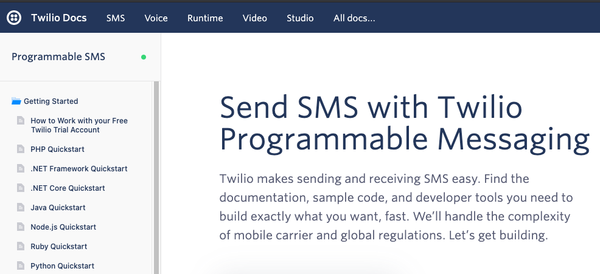

## twilio_sms_py

[](https://opensource.org/licenses/MIT)

Send text messages programmatically with Twilio SMS API


### Dependency Setup/Management:
* [Poetry Commands](https://python-poetry.org/docs/cli/)
```
curl -sSL https://raw.githubusercontent.com/python-poetry/poetry/master/get-poetry.py | python3 -
python get-poetry.py
poetry --version

# update configuration settings
poetry config virtualenvs.in-project true
poetry config experimental.new-installer false
poetry config --list

# create .lock and setup .venv
poetry check
poetry install -vvv | tee ./app/logs/poetry_install.log
```


### Run Client:
```
# change command-line arguments as needed
poetry run python ./TwilioClient.py -e LIVE -f 3034442000 -t 5035551000
```




## Resources:
* [Twilio](https://www.twilio.com)
* [Twilio API Documentation](https://www.twilio.com/docs/sms/api/message-resource)
```
within './app/config/*.toml':
[twilio.LIVE]
    account_sid = "123456789abcdefg"  # <-- enter your Account SID
    api_token = "abcdefg123456789"    # <-- enter your API token
```
